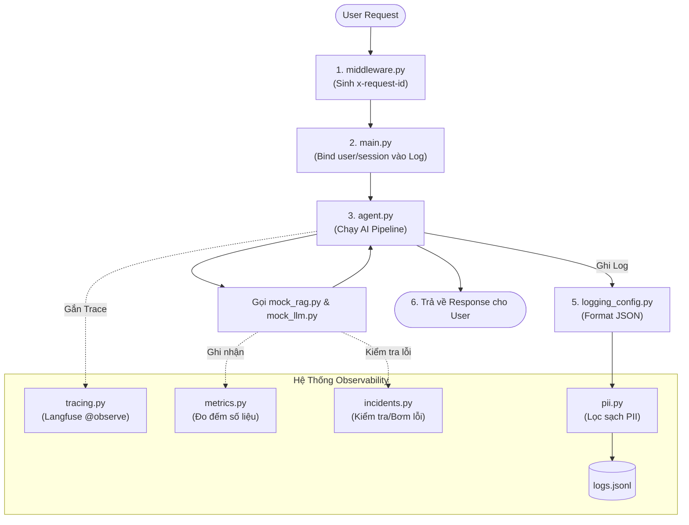

# Mục Tiêu Dự Án và Kiến Trúc Hệ Thống (Lab 13 - Observability)

## 1. Mục Tiêu Dự Án
Dự án này là một bài thực hành (Lab) tập trung vào việc xây dựng hệ thống **Observability (Khả năng quan sát)** cho một ứng dụng AI Agent được viết bằng FastAPI. Mục tiêu cụ thể bao gồm:
- **Logging (Ghi log):** Áp dụng Structured JSON Logging, yêu cầu phải có Correlation ID để theo dõi vết (trace) của request từ đầu đến cuối luồng, đồng thời tự động che giấu (redact/scrub) các dữ liệu nhạy cảm cá nhân (PII) không được rò rỉ.
- **Tracing (Theo vết):** Tích hợp Langfuse để quan sát chi tiết từng bước (spans/traces) trong quá trình AI Agent hoạt động (từ lúc nhận câu hỏi, gọi RAG, gọi LLM, đến lúc trả kết quả).
- **Metrics & Dashboard:** Thu thập các chỉ số hiệu suất trong bộ nhớ (in-memory metrics) và xuất ra để xây dựng một Dashboard 6-panel theo dõi sức khỏe tổng thể của hệ thống.
- **Alerting & SLO:** Thiết lập các mục tiêu chất lượng dịch vụ (SLO) và cấu hình cảnh báo (Alert rules) để phát hiện kịp thời khi hệ thống gặp sự cố.
- **Incident Response:** Hệ thống được thiết kế để có thể "bơm lỗi" (inject failures). Sinh viên phải dựa vào Logs, Metrics, Traces để thực hành chẩn đoán và tìm ra nguyên nhân gốc rễ (Root Cause Analysis).

---

## 2. Tác Dụng Của Từng File Trong Dự Án

### Thư mục `app/` (Mã nguồn chính)
- **`main.py`**: Điểm khởi chạy của ứng dụng FastAPI. Chứa các route API, nơi tiếp nhận request, thiết lập cấu hình log ban đầu và đính kèm (bind) các thông tin ngữ cảnh (user, session) vào log.
- **`middleware.py`**: Chứa logic Middleware để can thiệp vào request/response. Nhiệm vụ chính là tạo ra và gắn `x-request-id` (Correlation ID) cho mỗi luồng request để dễ dàng tra cứu toàn bộ log của một lượt tương tác.
- **`agent.py`**: Chứa logic cốt lõi của luồng AI Agent pipeline (nơi gọi công cụ tìm kiếm RAG và gọi mô hình LLM để tạo ra câu trả lời cuối cùng).
- **`logging_config.py`**: Cấu hình thư viện `structlog` để định dạng log đồng nhất dưới dạng JSON và kết nối với bộ lọc dữ liệu nhạy cảm.
- **`pii.py`**: Chứa các hàm, regex hoặc logic rule để phát hiện và làm mờ (scrub/redact) các thông tin định danh cá nhân (PII) như email, thẻ tín dụng, số điện thoại khỏi các chuỗi text trước khi ghi log.
- **`tracing.py`**: Nơi khởi tạo Langfuse client và chứa các hàm hỗ trợ/decorator để gắn trace cho hệ thống.
- **`schemas.py`**: Định nghĩa các model Pydantic cho Request, Response và Log Schema giúp chuẩn hóa cấu trúc dữ liệu đầu vào/đầu ra của hệ thống.
- **`metrics.py`**: Xử lý việc thu thập và tính toán các metrics cục bộ trong bộ nhớ (ví dụ: đếm số lượng request, đo thời gian phản hồi, đếm số lỗi xảy ra...).
- **`incidents.py`**: Chứa các cờ trạng thái (toggles) cho phép bật/tắt các lỗi giả lập trong hệ thống một cách có chủ đích.
- **`mock_llm.py` & `mock_rag.py`**: Các component giả lập mô hình ngôn ngữ (LLM) và công cụ tìm kiếm (RAG) trả về kết quả cố định (deterministic) để có thể test hệ thống mà không cần tốn chi phí gọi API OpenAI/Gemini thật.

### Thư mục `scripts/` (Công cụ test & giả lập)
- **`load_test.py`**: Script giả lập nhiều user truy cập cùng lúc, bắn tự động nhiều request vào API để kiểm tra sức chịu tải (load testing) và tạo ra dữ liệu log/trace thực tế để quan sát.
- **`inject_incident.py`**: Script dùng để kích hoạt một sự cố (như làm chậm hệ thống RAG, gây lỗi tool) khi app đang chạy nhằm test khả năng quan sát lỗi.
- **`validate_logs.py`**: Công cụ chạy để tự động chấm điểm kỹ thuật. Nó kiểm tra xem file log xuất ra đã đúng chuẩn schema chưa, có Correlation ID và đã lọc sạch các dữ liệu nhạy cảm (PII) hay chưa.

### Thư mục `config/` (Cấu hình và quy định)
- **`slo.yaml`**: Định nghĩa các Service Level Objectives mong đợi (ví dụ: 95% request phải có thời gian phản hồi dưới 2s).
- **`alert_rules.yaml`**: Định nghĩa các quy tắc khi nào thì kích hoạt báo động (ví dụ: kích hoạt báo động khi error rate vượt quá 5%).
- **`logging_schema.json`**: Cấu trúc mẫu chuẩn mà một dòng log phải tuân theo.

---

## 3. Luồng Hoạt Động (Workflow) Của Hệ Thống

Dưới đây là luồng di chuyển của một Request từ lúc người dùng gửi lên đến lúc nhận được kết quả, cũng như cách hệ thống Observability quan sát toàn bộ quá trình này:

1. **Nhận Request & Middleware (`middleware.py`):**
   - User gửi 1 câu hỏi (HTTP POST) lên API FastAPI.
   - Request đi qua `middleware.py` đầu tiên. Tại đây, hệ thống sinh ra một mã `x-request-id` (Correlation ID) duy nhất và đưa vào Context chung. Điều này đảm bảo toàn bộ các xử lý phía sau nếu in log đều sẽ có chung ID này.

2. **Route xử lý & Enrich Log (`main.py`):**
   - Request tiếp tục đi vào hàm API của `main.py`. Tại đây, các thông tin ngữ cảnh như `user_id`, `session_id` được lấy ra và đính (bind) vào cấu hình logger hiện tại.

3. **Thực thi Agent Pipeline (`agent.py` & `tracing.py`):**
   - Hàm xử lý của Agent bắt đầu chạy. Nó thường được gắn decorator `@observe` (từ `tracing.py`) nên hệ thống Langfuse bắt đầu ghi nhận "Trace" tổng thể cho thao tác này.
   - Agent tiến hành truy xuất thông tin: Gọi sang `mock_rag.py` (cũng được `@observe` để tạo ra một "span" con - biểu thị đây là 1 bước trong trace tổng).
   - Agent suy luận đáp án: Gọi sang `mock_llm.py` (tạo span con tiếp theo).

4. **Kiểm soát Lỗi & Metrics (`incidents.py` & `metrics.py`):**
   - Trong quá trình các mock-tool chạy, nó sẽ kiểm tra trạng thái cờ ở `incidents.py`. Nếu user đang chạy lệnh "bơm lỗi" (ví dụ `rag_slow = True`), `mock_rag.py` sẽ tự động dừng (sleep) thêm vài giây để tạo ra hiện tượng nghẽn cổ chai.
   - Bất kể kết quả thành công hay thất bại, `metrics.py` sẽ được gọi để ghi nhận thêm 1 lượt xử lý, cộng dồn tổng thời gian chạy, hoặc tăng biến đếm đứt gãy/lỗi.

5. **Ghi Log ra file (`logging_config.py` & `pii.py`):**
   - Xuyên suốt quá trình chạy Agent, code có sử dụng `logger.info()` hoặc `logger.error()` để ghi lại tiến độ công việc.
   - Các dòng log này sẽ đi qua cấu hình của `structlog` (`logging_config.py`). Trước khi được in ra màn hình hoặc ghi vào file JSON, dữ liệu đi qua hàm `pii_scrubber` (từ `pii.py`) để quyét và ẩn đi các dữ liệu nhạy cảm bằng dấu `***` hoặc `[REDACTED]`.
   - Chuỗi log cuối cùng (đã format đúng chuẩn schema, có đủ ID truy vết, sạch PII) sẽ được lưu ra file `data/logs.jsonl`.

6. **Hoàn trả Response:**
   - Agent tạo ra đáp án cuối cùng và FastAPI trả lại JSON Response cho User. Quá trình của một chu kỳ kết thúc. Bất kỳ kỹ sư nào khi nhìn vào file log/trace/metrics đều có thể hiểu chính xác request đó mất bao lâu, đi qua hàm nào, và có gặp lỗi gì không.
